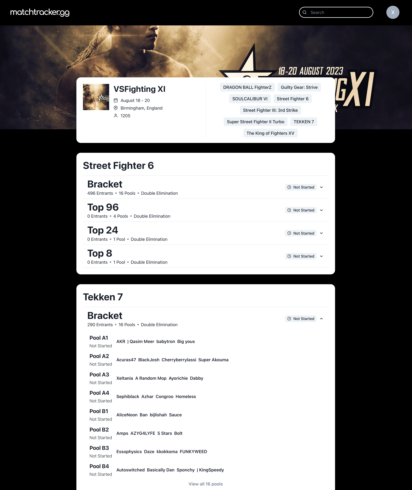

# [Matchtracker.gg](https://mgacuma.github.io/match-tracker/)

## Description

Welcome to Matchtracker.gg! A [lightweight] [vite](https://vitejs.dev/) + Typescript + React web app] that [queries from [start.gg](https://www.start.gg/)] GraphQL data. This project is designed to [display dynamic tournament information with lightweight GraphQL queries to support congested traffic conditions like Major tournaments]. With a focus on [quick and lightweight queries], Matchtracker.gg empowers [tournament spectators] to [stay up to date on highly anticipated matches].

## Table of Contents

- [Features](#features)
- [Usage](#usage)
- [Configuration](#configuration)
- [Contributing](#contributing)
- [License](#license)
- [Acknowledgements](#acknowledgements)

## Features

- **Dynamic Tournament Information**: Easily retrieve up-to-date tournament data through lightweight GraphQL queries, ensuring real-time accuracy even during congested traffic conditions such as during major tournaments.Keep users informed about the latest developments with live status indicators on brackets. Instantly identify matches in progress, completed matches, and upcoming fixtures, enhancing the overall engagement and experience.

- **Efficient Network Queries with [GraphQL](https://www.apollographql.com/docs/)**: Harnessing the power of Apollo and GraphQL to optimize network requests for speed and efficiency. GraphQL's flexible query system allows requests for only specific data needed, reducing the payload size and minimizing unnecessary data transfer.

- **Sleek and Speedy UI with [Chakra UI](https://chakra-ui.com/)**: Speedy interaction with tournament data through a blazing-fast and responsive user interface, thoughtfully designed and powered by the Chakra UI framework.

- **Secure User Authentication and Personalized Access**: Personalized user engagement and security with a robust user authentication system using AWS to provide secure access and personalized experiences. Also comes with a hassle-free onboarding experience with intuitive user registration and login processes that prioritize ease of use and security.

## Screenshots

### Home Page

### Tournament Page

### Login Page

### Signup Page

## Contributing

Contributions are welcome to enhance **Matchtracker.gg** and make it even better. To contribute, follow these steps:

1. Fork this repository.

2. Create a new branch: `git checkout -b feature/my-new-feature`.

3. Make your changes, whether it's adding new features, fixing bugs, or improving documentation.

4. Commit your changes: `git commit -am 'Add some feature'`.

5. Push to the branch: `git push origin feature/my-new-feature`.

6. Create a new Pull Request, describing the changes you've made and why they should be merged.

### Guidelines

- Ensure your code follows our coding standards and formatting guidelines.
- Provide clear and concise commit messages.
- Include necessary tests and ensure existing tests pass.
- Keep the documentation up to date if your changes affect it.
- Be respectful and considerate in your interactions and discussions around the project.

### Contact Me

If you find a bug or want to suggest an improvement, please write me a message! [Contact Me](https://mgacuma.github.io/hq/#contact).

## License

This project is licensed under the MIT License - see the [LICENSE](LICENSE) file for details.